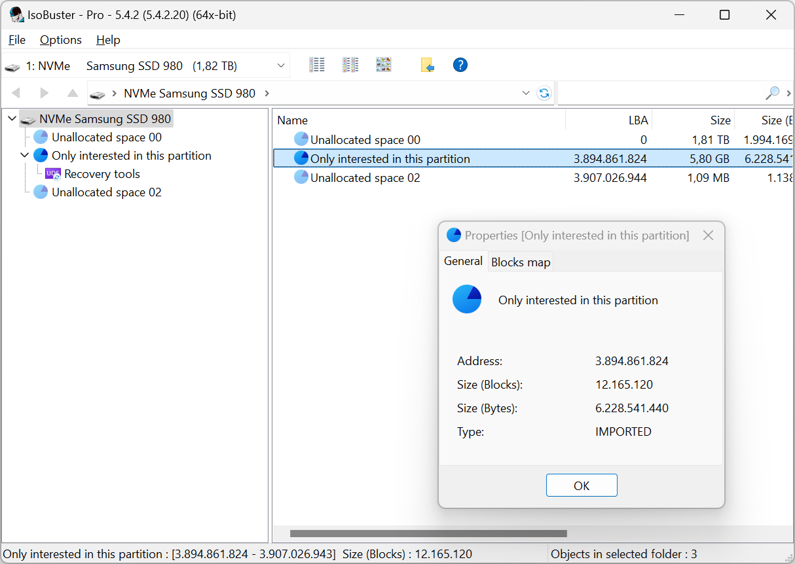
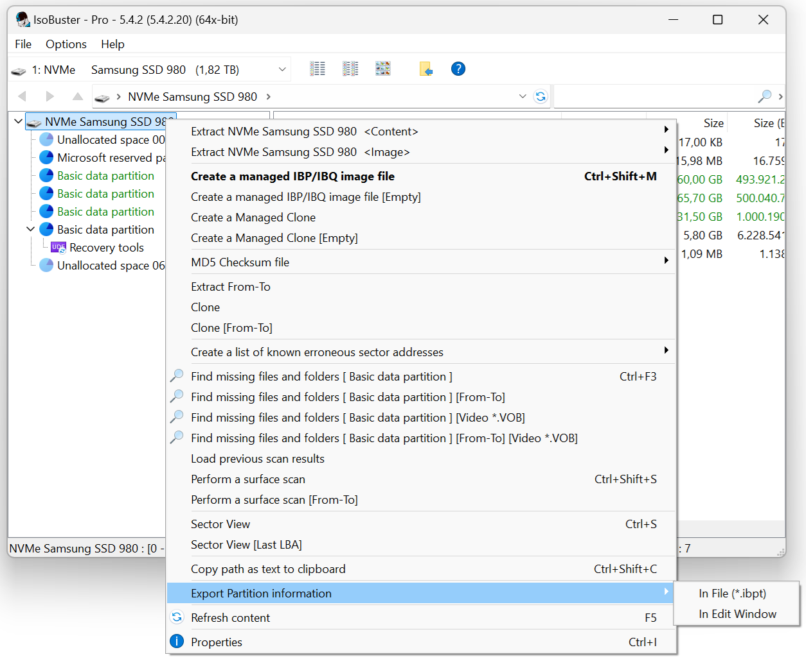

# ibpt
Map a different (custom) Partition table against data on a disk (or an image file) in [IsoBuster](http://www.isobuster.com).<br>
This tells IsoBuster to ignore the on-disk MBR, GPT, .. partition table data in favour of whatever is contained in the \*.ibpt file

This feature is available since [IsoBuster 5.3](https://www.isobuster.com/news/isobuster_5.3_release_notes)

To **export** a \*.ibpt partition-table file:
 - Select a drive or load an image file
 - Hold CTRL+SHIFT while right mouse clicking the top most icon in the left pane
 - Choose "Export Partition information"

To **import** a \*.ibpt partition-table file:
 - Select a drive or load an image file
 - Drag the \*.ibpt file onto IsoBuster

The \*.ibpt file is a simple text file that can be opened with any text editor.

Make changes per your requirements or per your test data before dragging it onto IsoBuster.
This way you can easily expose hidden partitions, if you know (or found) where they are.

Example:
```c++
// [Address], [Blocks], [Offset], [Name], [Year], [Month], [Day], [Hour], [Minute], [Second], [GMTOffset]
3894861824, 12165120, 0 ,Only interested in this partition, 0, 0, 0, 0, 0, 0, 0
```




From IsoBuster 5.5 onwards it is also possible to link to the *.ibpt file from a [*.imlst file](https://github.com/Isobuster/imlst)
